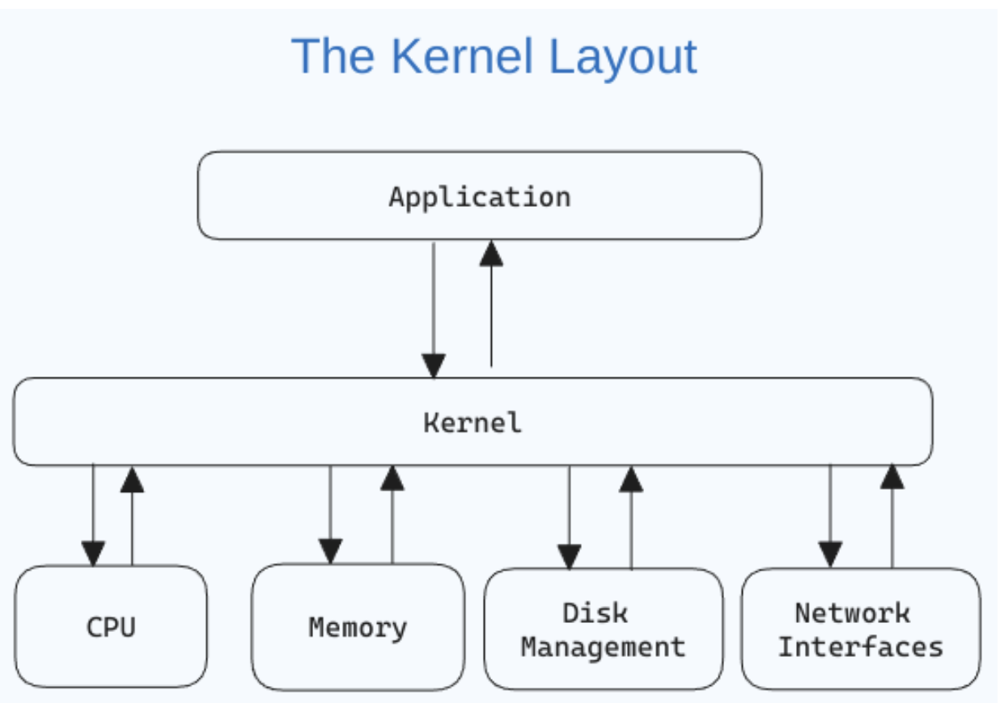

# note

1. what is kernel ?
   Бодол болон бидний биеийг хооронд нь холбодог .
   
   Та дээрх зургаас харж байгаа бол kernel нь application болон доорх дөрвөн нөхдийн дунд байна . cpu , network interface , disk management болон memory байдаг ажээ .
2. **uname** - to name os .
3. **sysstl** - to get cup info
4. **man hier** коммандыг ашиглан фолдеруудын үүргийг тайлж болно .
5.
